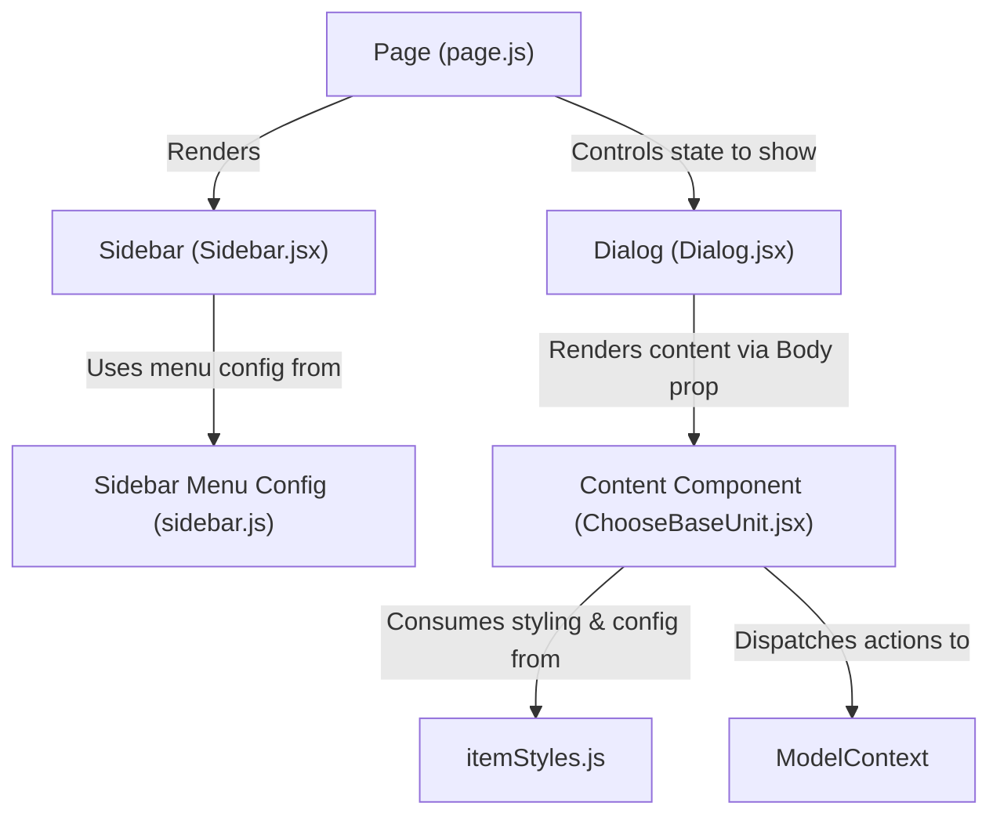

```mermaid
graph TD;
  A["Page (page.js)"]
  B["Sidebar (Sidebar.jsx)"]
  C["Sidebar Menu Config (sidebar.js)"]
  D["Dialog (Dialog.jsx)"]
  E["Content Component (ChooseBaseUnit.jsx)"]
  F["itemStyles.js"]
  G["ModelContext"]

  A -->|Renders| B
  A -->|Controls state to show| D
  B -->|Uses menu config from| C
  D -->|Renders content via Body prop| E
  E -->|Consumes styling & config from| F
  E -->|Dispatches actions to| G

```
